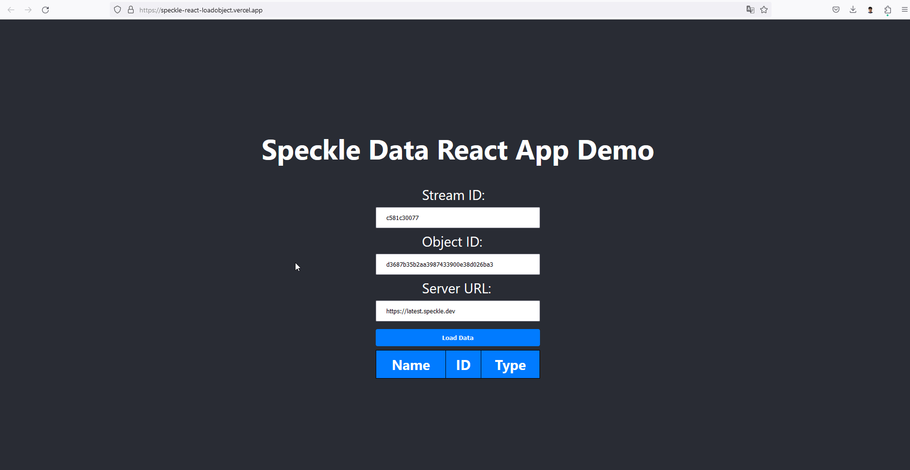

# Getting Started Speckle Object with React App

Demo : https://speckle-react-loadobject.vercel.app/

# Demo with data : 

- Speckle Stream : https://latest.speckle.dev/streams/c581c30077/commits/f47d03ab3e
- StreamId : c581c30077
- ObjectId : d3687b35b2aa3987433900e38d026ba3
- serverUrl = 'https://latest.speckle.dev'

Note : Please replace with your own streamId, objectId and serverUrl in `SpeckleLoader.js`
# How to run

- Download and install [Node.js](https://nodejs.org/en/download/) latest version (My version : v18.17.1)
- Clone project 
- Run `npm install` to install dependencies
- Run `npm start` to start the app
- Open [http://localhost:3000](http://localhost:3000) to view it in the browser.
- Click load data button to load data from speckle stream
- View the console to see the data by Right click > Inspect > Console
Preview 

