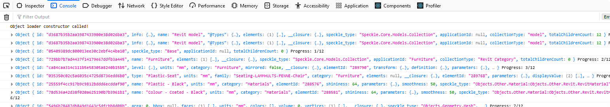

# Getting Started Speckle Object with React App

- Download and install [Node.js](https://nodejs.org/en/download/) latest version
- Clone project 
- Run `npm install` to install dependencies
- Run `npm start` to start the app
- Open [http://localhost:3000](http://localhost:3000) to view it in the browser.